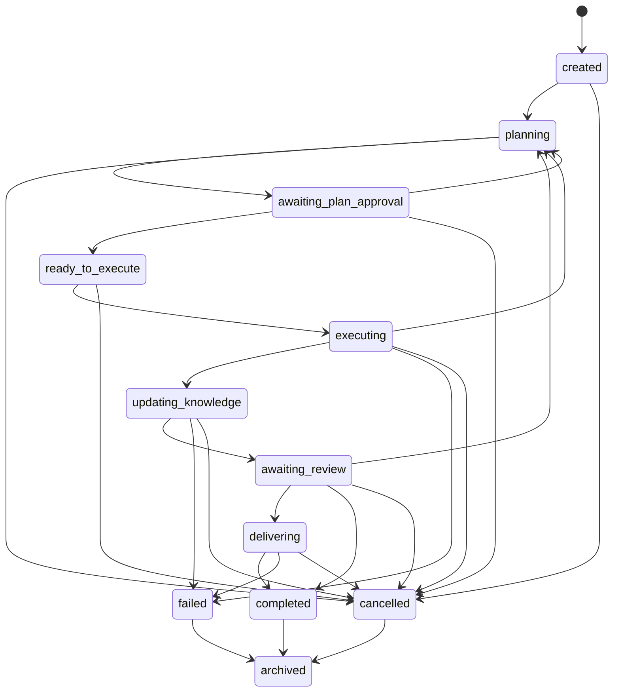
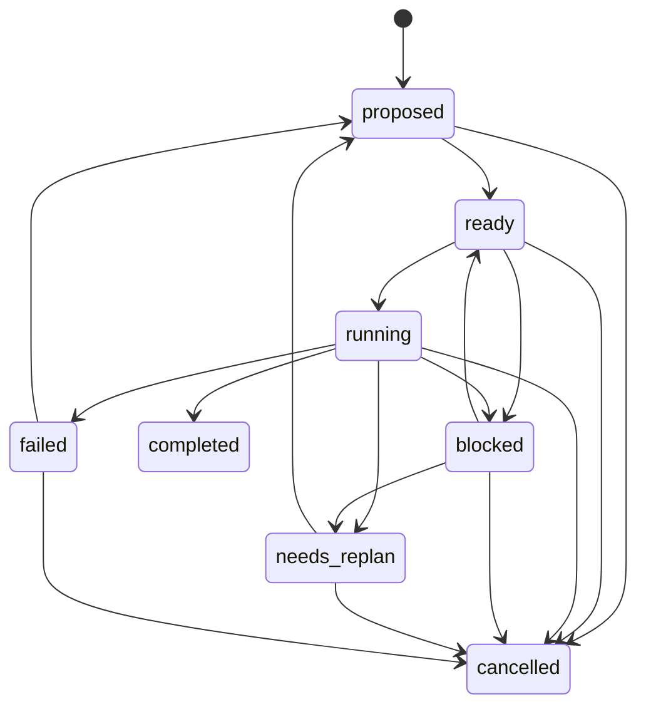
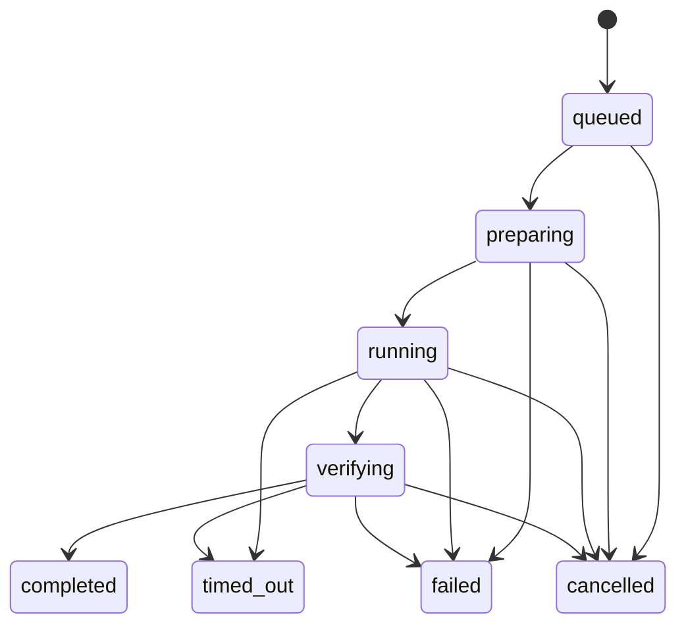
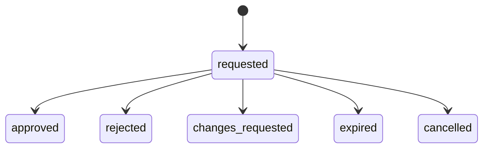

# Watt V1.0 状态机

## 1. 文档目的

本文档定义 Watt V1 阶段 `Session`、`Task`、`Run`、`Approval` 的状态集、合法迁移与关键不变量。

这份文档的目标不是描述所有异常细节，而是为 `Workflow Engine` 提供最小但足够明确的状态机约束。

## 2. 设计前提

### 2.1 MVP 执行模型

MVP 阶段采用以下前提：

- 控制面可以以内聚单体实现
- 执行面以独立 worker / daemon 方式运行
- 同一 `Session` 的状态推进由 `Workflow Engine` 串行决策
- 同一 `Task` 在任意时刻只允许一个活跃 `Run`

### 2.2 平台状态与业务状态分离

本文档只定义平台内部状态机：

- `Session`
- `Task`
- `Run`
- `Approval`

外部业务对象状态，例如 Issue、PR、IM Thread、Linear Task，不在本文档的状态机范围内。

### 2.3 Event 驱动状态迁移

所有状态迁移都遵循同一规则：

`当前状态 + Event -> Workflow Engine 决策 -> 生成 Command -> 产生下一状态`

其他模块不得绕过 `Workflow Engine` 直接迁移状态。

## 3. 全局不变量

### 3.1 单活跃 Run

对任意 `Task`，任意时刻最多只允许一个处于以下活跃态的 `Run`：

- `queued`
- `preparing`
- `running`
- `verifying`

### 3.2 单 Session 归属

任意 Event 在 MVP 阶段最多只能关联一个主 `Session`。不支持一个 Event 同时驱动多个 Session。

### 3.3 Session 内串行决策

同一 `Session` 相关 Event 的状态推进必须串行处理。并发到达的 Event 可以并发接收，但进入 `Workflow Engine` 后必须按 Session 粒度串行消费。

### 3.4 Task 完成不等于业务验收完成

`Task.completed` 仅表示平台确认该 Task 的执行目标已完成，不代表外部业务对象已经被人类最终验收。

人类结果复核由 `Approval` 和 `Session` 状态承载。

## 4. Session 状态机

### 4.1 状态定义

| 状态 | 含义 |
|---|---|
| `created` | Session 已建立，但尚未进入正式规划 |
| `planning` | 正在生成或重生成计划 |
| `awaiting_plan_approval` | 计划已产出，等待人类确认 |
| `ready_to_execute` | 计划已获批准，可进入执行调度 |
| `executing` | 至少有一个 Task 正在执行中 |
| `updating_knowledge` | 执行完成后，正在写回 Knowledge |
| `awaiting_review` | Knowledge 已更新，等待人工结果复核 |
| `delivering` | 正在进行外部交付或状态同步 |
| `completed` | 本轮工作流已完成 |
| `failed` | 系统确认当前 Session 无法自动继续推进 |
| `cancelled` | 人工或系统主动终止 Session |
| `archived` | 终态 Session 被归档，不再参与主动流转 |

### 4.2 合法迁移

### 4.3 迁移规则

- `created -> planning`
  触发条件：收到首个可启动工作流的 Event。

- `planning -> awaiting_plan_approval`
  触发条件：Planner 成功生成可复核计划。

- `awaiting_plan_approval -> ready_to_execute`
  触发条件：计划确认 Approval 被批准。

- `awaiting_plan_approval -> planning`
  触发条件：计划被拒绝，或收到反馈要求重新规划。

- `ready_to_execute -> executing`
  触发条件：至少一个 Task 被调度为 Run。

- `executing -> updating_knowledge`
  触发条件：本轮需要执行的 Task 均已成功完成，且需要写回 Knowledge。

- `executing -> planning`
  触发条件：执行结果表明需要再规划，例如上下文不足、方案失效、人工补充要求。

- `updating_knowledge -> awaiting_review`
  触发条件：Knowledge 写回完成，Task 状态已推进。

- `awaiting_review -> delivering`
  触发条件：结果复核通过，且需要外部交付。

- `awaiting_review -> completed`
  触发条件：结果复核通过，但不需要额外交付。

- `awaiting_review -> planning`
  触发条件：结果复核要求继续修改或重新规划。

### 4.4 Session 终态语义

- `completed`: 当前闭环已完成，可等待新的外部 Event 重新开启新 Session。
- `failed`: 当前 Session 在恢复预算内无法自动完成，需要人工处理或新建后续 Session。
- `cancelled`: 当前 Session 被明确终止。
- `archived`: 仅用于历史归档，不再接受主动状态迁移。

## 5. Task 状态机

### 5.1 状态定义

| 状态 | 含义 |
|---|---|
| `proposed` | Task 已由 Planner 提出，但尚未获得计划确认 |
| `ready` | Task 已获批准，等待依赖满足与执行调度 |
| `running` | 当前有活跃 Run 在执行该 Task |
| `completed` | Task 的执行目标已完成 |
| `blocked` | 因外部依赖、上下文缺失或人工等待而阻塞 |
| `needs_replan` | 现有 Task 已不适用，需要回到规划阶段 |
| `failed` | Task 在恢复预算内未能完成 |
| `cancelled` | Task 被显式取消 |

### 5.2 合法迁移

### 5.3 迁移规则

- `proposed -> ready`
  触发条件：所属计划已获批准，且 Task 结构被正式接受。

- `ready -> running`
  触发条件：`Run Scheduler` 为该 Task 创建活跃 Run。

- `running -> completed`
  触发条件：活跃 Run 成功完成且验证通过。

- `running -> blocked`
  触发条件：执行中发现缺少外部输入、资源或人工决策。

- `running -> needs_replan`
  触发条件：当前 Task 目标或拆解方式已失效，需要重新规划。

- `running -> failed`
  触发条件：超过重试预算，且 `Workflow Engine` 判定不再自动恢复。

- `blocked -> ready`
  触发条件：阻塞条件解除。

- `needs_replan -> proposed`
  触发条件：新一轮规划结果重新生成或替换该 Task。

- `failed -> proposed`
  触发条件：人工确认继续推进，并允许以新计划重新开启该 Task。

## 6. Run 状态机

### 6.1 状态定义

| 状态 | 含义 |
|---|---|
| `queued` | Run 已创建，等待准备执行环境 |
| `preparing` | 正在准备 Workspace、依赖或 provider 上下文 |
| `running` | 执行后端正在处理任务 |
| `verifying` | 代码执行已结束，正在跑验证流程 |
| `completed` | 本次 Run 成功结束 |
| `failed` | 本次 Run 失败 |
| `timed_out` | 本次 Run 因超时或失联被 Watchdog 终止 |
| `cancelled` | 本次 Run 被人工或系统取消 |

### 6.2 合法迁移

### 6.3 迁移规则

- `queued -> preparing`
  触发条件：执行资源已分配，开始创建 Workspace。

- `preparing -> running`
  触发条件：执行后端已启动。

- `running -> verifying`
  触发条件：执行后端返回代码修改结果，进入验证阶段。

- `verifying -> completed`
  触发条件：验证通过，产物已归档。

- `running / verifying -> timed_out`
  触发条件：`Run Watchdog` 检测到超时、心跳丢失或执行悬挂。

### 6.4 Run 与 Task 的关系

- `Run.completed` 会驱动 `Task` 进入 `completed`
- `Run.failed` 或 `Run.timed_out` 不直接决定 `Task.failed`
- `Task` 是否失败由 `Workflow Engine` 根据重试预算和恢复策略判定

## 7. Approval 状态机

### 7.1 状态定义

| 状态 | 含义 |
|---|---|
| `requested` | 审批已创建，等待人类处理 |
| `approved` | 人类已批准 |
| `rejected` | 人类已拒绝 |
| `changes_requested` | 人类要求补充或修改 |
| `expired` | 审批超时失效 |
| `cancelled` | 审批因流程终止或替换而取消 |

### 7.2 合法迁移

### 7.3 Approval 类型

MVP 阶段至少支持三类 Approval：

- `plan_approval`: 计划确认
- `result_review`: 结果复核
- `delivery_approval`: 高风险交付前确认

## 8. 顺序性、并发与幂等

### 8.1 Session 级顺序性

同一 `Session` 的状态推进必须串行。实现上可以采用以下任一方式：

- Session 粒度内存串行队列
- Session 粒度数据库锁
- Session 粒度乐观版本控制

MVP 不要求先决定技术方案，但必须保证逻辑上的串行决策。

### 8.2 Event 幂等

重复 Event 不应导致重复状态迁移。MVP 阶段至少需要：

- `event_id`
- `idempotency_key`
- 已处理事件记录

### 8.3 活跃 Run 约束

创建 Run 前必须再次校验该 Task 当前不存在活跃 Run。即使在事件并发到达场景下，也必须以原子方式维护该不变量。

## 9. 与后续文档的关系

本文档定义的是状态迁移约束。后续文档应在此基础上继续补齐：

1. Event / Command 信封
2. Project / Knowledge Space 数据模型
3. 审批与交付协议
4. 运行时模型与适配器协议
